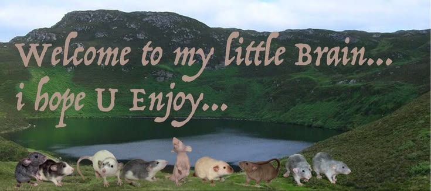

# Hi, I'm Meysya 👋

I'm an Information Technology student at Universitas Brawijaya interested in technology, system analysis, project management, and AI.

## 🚀 What I Do

- 💻 Software & Web Development
- 🔍 System & Business Process Analysis
- 📊 Data & Technology Projects
- 📋 Project Management
- 🤖 AI & Emerging Technologies

## 🛠️ Tech & Tools

React • TypeScript • Python • JavaScript • SQL • Git • GitHub • Supabase

## 📂 Featured Projects

- AI Contract Risk Analyzer
- Fire Detection System
- PlanCraft
- Grocery
- Sedentary

## 🔗 Connect With Me

🌐 Portfolio: https://myscalista.netlify.app  
💼 LinkedIn: https://www.linkedin.com/in/meysyaindahcalistap

## GitHub Trophies

## GitHub Activity Graph

